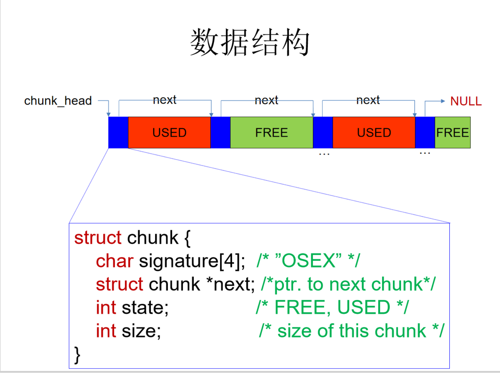
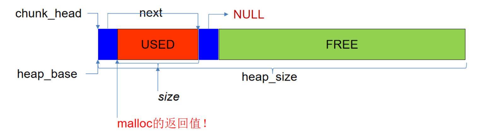
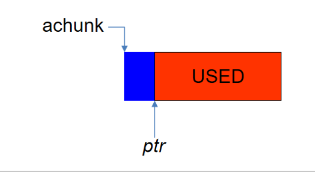

# 重庆大学操作系统实验五<br>
## 五、内存管理<br>
### 实验内容
编辑文件userapp/myalloc.c实现如下四个接口函数<br>
malloc/free/calloc/realloc<br>
<br>

### 数据结构

#### chunk结构体内的size为 实际分配的内存大小+chunk结构体在内存中占用的大小


### 接口函数
#### 一、初始化内存分配器
```C
void *tlsf_create_with_pool(uint8_t *heap_base, size_t heap_size)
{
    chunk_head = (struct chunk*)heap_base;
    strncpy(chunk_head->signature,"OSEX",4);
    chunk_head->next = NULL;
    chunk_head->state = FREE;
    chunk_head->size = heap_size;
    return NULL;

}
```
#### 二、malloc
功能：分配大小是size字节的内存块，并返回块地址<br>
如果size是0，返回NULL<br>
<br>

##### 在下列实现中，需要注意为了防止超界访问，分配内存时应该分类：
1、空余的空间能够放下 当前分配的头+分配内存大小+下一个头<br>
2、空余空间大小 = 当前分配头 + 分配内存大小<br>

##### 应该注意到，在上述分类方案的实现中，在 分配内存大小+2*分配头>空余空间大小>当前分配头+分配内存大小 的情况下内存不能被充分利用
对此在free函数中采用了合并相邻空闲块的方法来解决(见三、free)<br>

```c
void *malloc(size_t size)
{
  
  if (size==0)  //输入大小为0时,不做分配
      return NULL;

    sem_wait(heap_lock); //加锁
  int find =0;
  struct chunk * start = chunk_head;
  while(start!=NULL){
    if (start->state == FREE){
      //printf ("chunk size = %d\n",start->size);
      if (start->size >= (size + 2*head_size)){
        struct chunk *nxt = (struct chunk *)((uint8_t *)start + head_size + size );
        memcpy(nxt, start, head_size);
        nxt->size = start->size - size - head_size;
        start->next = nxt;
        start->state = USED;    //先标记为已使用
        start->size = size + head_size;  //分配大小
        find =1;
        break;
      }
      else if (start->size == (size + head_size)){
        start->state = USED;    //先标记为已使用
        find = 1;
        break;
    }
  }
  start = start->next;  
} 
  sem_signal(heap_lock); //解锁
  if (find==1)
    {return (void*) (start+1);} //在C语言中，指针加1表示加上sizeof(struct chunk)的大小
  else
    {return NULL;} //没有找到合适的内存块
  
}
```

#### 三、free
功能：<br>
1、释放ptr指向的内存块<br>
2、如果ptr是NULL，直接返回<br>
提示：怎么根据ptr得到chunk？<br>
struct trunk *achunk=(struct chunk *)(((uint8_t *)ptr)-sizeof(struct chunk)); <br>


##### 合并相邻的空闲块：由于数据结构为单向链表，所以需要从头遍历
```c
void free(void *ptr)
{
  if (ptr==NULL)
    return; //输入指针为空时,不做释放

  sem_wait(heap_lock);

  struct chunk *achunk=(struct chunk *)(((uint8_t *)ptr)-sizeof(struct chunk));

  if (achunk->signature[0] == 'O' &&
    achunk->signature[1] == 'S' &&
    achunk->signature[2] == 'E' &&
    achunk->signature[3] == 'X')

    {
    achunk->state = FREE; //将当前块标记为未使用
    achunk = chunk_head;
  while (achunk->next != NULL){
    if (achunk->state == FREE && achunk->next->state == FREE){ //如果下一个块也是未使用的,则合并
      achunk->size += achunk->next->size;
      achunk->next = achunk->next->next;
    }
    else{
      achunk = achunk->next;
    }
  }
}
sem_signal(heap_lock);  // 解锁
}
```

#### 四、calloc
功能：<br>
1、为num个元素的数组分配内存，每个元素占size字节<br>
2、把分配的内存初始化为0<br>

##### 本质上是封装的malloc函数
```c
void *calloc(size_t num, size_t size)
{
    size_t space = num*size;
    void *ptr = malloc(space);
    memset(ptr, 0, space);
    return ptr;
}
```

#### 五、realloc
功能:<br>
重新分配oldptr指向的内存块，新内存块有size字节<br>
把旧内存块的内容复制到新内存块<br>
如果新内存块还在原来的地址oldptr，返回oldptr;否则返回新地址<br>

```c
void *realloc(void *oldptr, size_t size)
{
    if (size == 0) {
        free(oldptr);
        return NULL;
    }
    if (oldptr == NULL) {
        return malloc(size);
    }

    

    struct chunk *oldchunk = (struct chunk *)(((uint8_t *)oldptr)-sizeof(struct chunk));
    void *newptr = malloc(size);
    if (!newptr) {
      
      return NULL;
    }
      struct chunk *newchunk = (struct chunk *)(((uint8_t *)newptr) - sizeof(struct chunk));

    //下面的复制操作的复制内容包括了chunk的头部
    if (oldchunk->size<=newchunk->size){
      memcpy(newptr,oldptr,oldchunk->size-sizeof(struct chunk)); //将原来的数据拷贝到新的内存块中
      free(oldptr); //释放原来的内存块
      
      return newptr;
    }
    else if (oldchunk->size>newchunk->size){
      memcpy(newptr,oldptr,newchunk->size-sizeof(struct chunk)); //只复制newchunk长度的数据
      free(oldptr); //释放原来的内存块
      
      return newptr;
      
    }
}
```

#### 六、锁机制
在这里实现锁机制，由于没有第三方库，所以应该使用实验四中实现的信号量。<br>
使用二值信号量来控制进程时，需要注意：每一次加锁都要保证锁被正确的释放。<br>
所以在malloc和free函数的各个分类中都要正确的加、释放锁，不要在没有释放锁的时候return<br>
